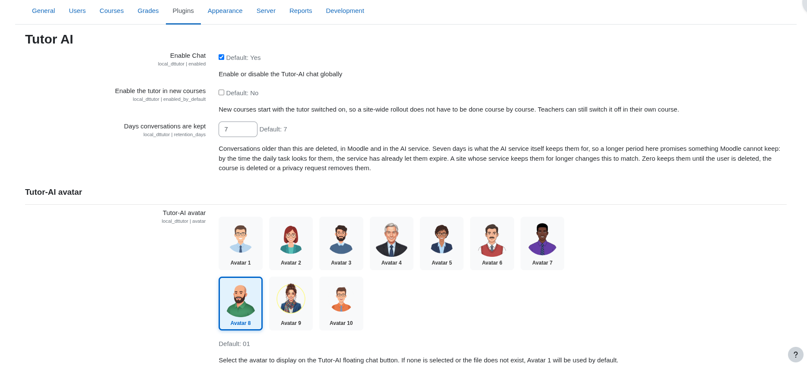
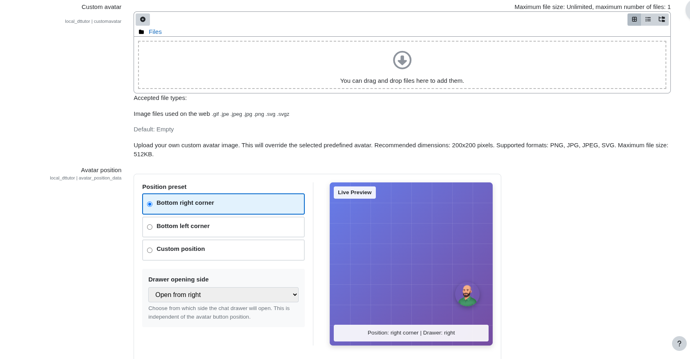
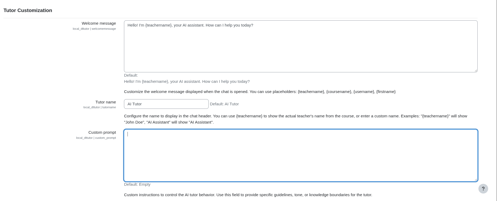
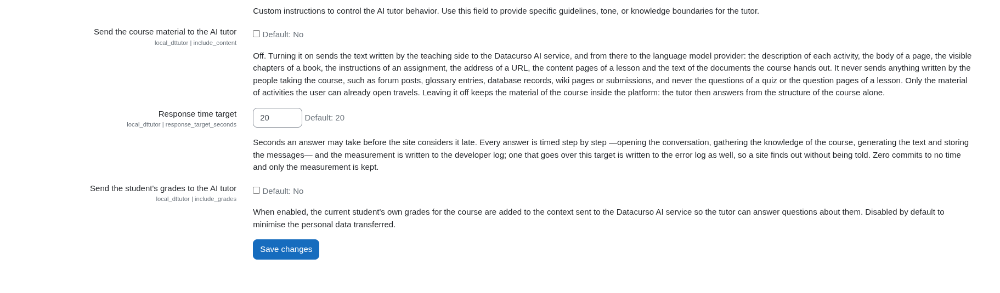
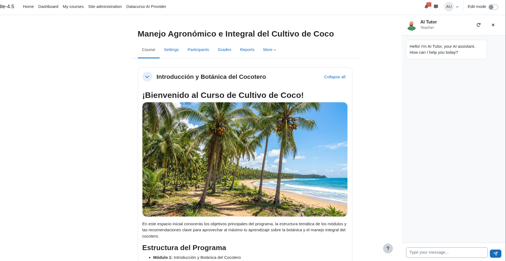

# AI Tutor Chat for Moodle

An intelligent conversational assistant that integrates seamlessly into your Moodle courses, providing real-time AI-powered support to students and teachers through a floating chat interface.

## What does it do?

AI Tutor Chat adds a floating avatar button to course pages that opens an AI-powered chat drawer. Students and teachers can interact with the AI assistant to:

- **Get instant help** with course content and questions
- **Receive personalized guidance** based on their role (student/teacher)
- **Experience real-time responses** with streaming text display
- **Access contextual assistance** aware of the current course and activity

The chat interface features:
- Customizable avatar with 10 built-in options
- Flexible positioning (bottom-right or bottom-left corner)
- Real-time streaming responses using Server-Sent Events (SSE)
- Automatic role detection for personalized interactions
- Keyboard shortcuts (Enter to send, Escape to close)
- Mobile-responsive design

## Screenshots

### Admin Settings



**General settings and avatar**: the global *Enable Chat* toggle, *Enable the tutor in new courses*, *Days conversations are kept* (default 7), and the gallery of 10 built-in avatars.

---



**Custom avatar and position**: upload your own avatar image, pick a position preset (bottom-right corner, bottom-left corner or custom position), choose the side the drawer opens from, and check the result in the live preview.

---



**Tutor customization**: the welcome message, the tutor name and a custom prompt for institutional instructions. The welcome message supports the `{teachername}`, `{coursename}`, `{username}` and `{firstname}` placeholders.

---



**Data sent to the AI and response time**: *Send the course material to the AI tutor* (off by default), *Response time target* (default 20 seconds) and *Send the student's grades to the AI tutor* (off by default).

---

### Chat Interface



**Chat drawer on a course page**: the AI tutor drawer open next to the course content, with the tutor name, the detected role (Teacher), the welcome message, and buttons to reset the conversation and close the drawer.

## Explore the suite

AI Tutor Chat is part of the **Datacurso AI Suite**, a collection of intelligent tools designed to enhance the Moodle learning experience:

- **[Course Creator AI](https://github.com/industria-elearning/moodle-local_coursegen)** - Generate complete courses automatically using AI
- **[Ranking Activities AI](https://github.com/industria-elearning/moodle-local_ranking)** - Analyze student feedback with AI-powered insights
- **[Forum AI](https://github.com/industria-elearning/moodle-local_forumgrade)** - Enhance discussion engagement with intelligent moderation
- **[Assign AI](https://github.com/industria-elearning/moodle-local_assigngrade)** - Streamline assignment review with AI assistance
- **AI Tutor Chat** - Provide real-time conversational AI support (this plugin)

All plugins in the suite require the **Datacurso AI Provider** to function.

## Pre-requisites

Before installing AI Tutor Chat, ensure your system meets these requirements:

1. **Moodle 4.5 or later** - This plugin requires Moodle version 4.5 or higher
2. **Datacurso AI Provider plugin** - Must be installed and configured
   - Download the free AI Provider plugin from [Moodle Plugins Directory](https://moodle.org/plugins/aiprovider_datacurso)
   - Install the AI Provider plugin
   - Configure your license key
   - **This plugin will not function unless the Datacurso AI Provider plugin is installed and licensed**
3. **Valid License Key** - Configure your license in the Datacurso AI Provider settings

## Installation

### Method 1: Upload via Moodle Admin Panel

1. Download the plugin ZIP file
2. Go to **Site administration > Plugins > Install plugins**
3. Upload the ZIP file
4. Click **Install plugin from the ZIP file**
5. Follow the on-screen installation prompts

### Method 2: Manual Installation

1. Extract the plugin files to your Moodle installation:
   ```bash
   cd /path/to/moodle/local
   unzip dttutor.zip
   # or use git clone
   ```

2. Run the Moodle upgrade process:
   ```bash
   php admin/cli/upgrade.php --non-interactive
   ```

3. Complete the installation by following any additional prompts

## Configuration

After installation, configure the plugin:

1. Navigate to **Site administration > Plugins > Local plugins > AI Tutor**

2. **General settings**:
   - **Enable Chat** (enabled by default): turns the floating chat on or off for the whole site
   - **Enable the tutor in new courses** (disabled by default): new courses start with the tutor switched on, so a site-wide rollout does not have to be done course by course. Teachers can still switch it off in their own course
   - **Days conversations are kept** (default `7`): conversations older than this are deleted in Moodle and in the AI service. Seven days matches what the AI service keeps. `0` keeps them until the user or the course is deleted, or a privacy request removes them

3. **Customize Appearance**:
   - **Avatar**: Choose from 10 available avatars (01-10) or upload a custom image
   - **Avatar Position**: Pick the bottom-right or bottom-left corner, or the *Custom position* preset and drag the avatar in the live preview to the exact spot; the drawer side (left/right) is configured independently

4. **Tutor Customization**:
   - **Welcome message**: The first message shown when the chat opens; supports the `{teachername}`, `{coursename}`, `{username}` and `{firstname}` placeholders
   - **Tutor name**: The name shown in the chat header (`{teachername}` shows the course teacher's name)
   - **Custom prompt**: Institutional instructions appended to the tutor's system prompt

5. **Data sent to the AI and response time**:
   - **Send the course material to the AI tutor** (`include_content`, disabled by default): when enabled, the text written by the teaching side (activity descriptions, pages, visible book chapters, assignment instructions, URLs, lesson content pages and course documents) is sent to the Datacurso AI service. Nothing written by learners (forum posts, submissions, etc.) and no quiz questions are ever sent. When disabled, the tutor answers from the course structure alone
   - **Response time target** (`response_target_seconds`, default `20`): the number of seconds after which an answer counts as late. Every answer is timed step by step (session, course knowledge, answer, storage). The measurement goes to the developer log, and answers over the target also go to the error log. `0` disables the target and only keeps the measurement
   - **Send the student's grades to the AI tutor** (`include_grades`, disabled by default): when enabled, the student's own grades for the course are added to the context sent to the Datacurso AI service so the tutor can answer questions about them

6. The plugin automatically uses your Datacurso AI Provider configuration for API connectivity

### Supported Languages

AI Tutor Chat is available in 7 languages:
- Spanish (es)
- English (en)
- German (de)
- French (fr)
- Portuguese (pt)
- Indonesian (id)
- Russian (ru)

## Usage

### For Students and Teachers

1. **Open the chat**: Click the floating avatar button in the corner of any course page

2. **Type your message**: Enter your question or message in the text field
   - Press `Enter` to send
   - Press `Shift+Enter` for a new line
   - Maximum 4,000 characters per message

3. **Receive AI response**: Watch the AI assistant respond in real-time with streaming text

4. **Close the chat**:
   - Click the X button in the drawer header
   - Click the floating avatar button again
   - Press `Escape` key

### Features

- **Auto-scroll**: Chat automatically scrolls as new content arrives
- **Typing indicator**: Visual feedback while AI processes your message
- **Error handling**: Clear messages if connection issues occur
- **Role-aware**: AI adapts responses based on whether you're a student or teacher
- **Context-aware**: AI knows which course and activity you're viewing

## Data processed and transferred

AI Tutor Chat processes personal data both inside Moodle and in the external Datacurso AI service. Privacy officers can review and act on it through the standard Moodle Privacy API (**Site administration > Users > Privacy and policies**).

### Stored in Moodle

| Where | What | Why |
|---|---|---|
| `local_dttutor_course_config` | The per-course enablement flag and the ID of the user who last edited it | Enable the tutor per course |
| `local_dttutor_session` | One handle per user, course and activity of the chat session opened in the Datacurso AI service (no message content) | Reuse the remote session and be able to delete it later |
| Cache `local_dttutor/sessions` | The same session handles, for fast lookup | Avoid creating a new remote session on every request |

### Sent to the Datacurso AI service

Every request made through the Datacurso AI Provider carries the site URL, an anonymous site identifier, the user ID, the user's language and timezone. On top of that, the tutor sends:

- the chat messages written by the user and the tutor's previous answers;
- the course structure visible to that user (activities, sections, dates, maximum grades) and the URL of the page the message was sent from;
- the ID of the activity being viewed and any text the user selected on the page to ask about;
- the institutional custom prompt configured by the administrator;
- the course material written by the teaching side, **only** when the administrator enables *Send the course material to the AI tutor* (disabled by default);
- the student's own grades in the course, **only** when the administrator enables *Send the student's grades to the AI tutor* (disabled by default).

Nothing else from the client (for example the user's name or arbitrary page metadata) is forwarded: the plugin builds the context server-side and only accepts an allowlisted set of keys from the browser.

### Export and deletion

- **Privacy API export** returns, per course, the user's stored session handles with **the messages of each conversation**, read page by page from the Datacurso AI service, and the course configuration entries they edited. When the service cannot be reached the export still completes and says, for each conversation, that its messages could not be read and why, so it never looks complete when it is not.
- **Privacy API deletion** (per user, per course, or for a set of users in a course) asks the Datacurso AI service to delete every conversation of that user and course, including the ones opened before the session handles began to be stored, and then deletes the stored session rows. The reference to the last editor of the course configuration is cleared; the course configuration itself is kept because it belongs to the course, not to a person.
- **Course deletion** removes the course configuration and the course's sessions (locally and remotely).
- **User deletion** removes the user's sessions (locally and remotely).
- **Retention**: the scheduled task *Delete conversations past the retention period* removes the conversations older than the configured number of days, here and in the AI service.

The local deletion always completes, so a privacy request never waits on a third party. A remote deletion the service does not confirm (it is down, the licence is not valid, the request times out) is **not forgotten**: it is kept in `local_dttutor_pending_delete` and the scheduled task *Retry the conversation deletions the AI service has not confirmed* (every 15 minutes) asks again, waiting longer after each failure, up to a day. A session the service no longer has (HTTP 404) counts as deleted. After eight failed attempts an *AI service failure* event with the operation `remote_deletion` is recorded and the error log says so, while the deletion keeps being retried until the service confirms it.

### Usage limits

Each question costs a call to the AI service and keeps a PHP worker busy while the answer streams, so the plugin limits them itself, before anything leaves the site and whatever the rate limit of the AI provider:

| Setting | Default | Meaning |
|---|---|---|
| Questions per user and course | 30 | Questions one user may ask in one course in each window. |
| Questions per course | 600 | Questions all the users of a course may ask together in each window. |
| Window (minutes) | 10 | Length of the window the questions are counted in (1 to 1440). |
| Answers at once per user | 2 | Answers one user may have streaming at the same time. |

A question over a limit is answered with HTTP 429 and a `Retry-After` header, and the chat tells the user when they may ask again. `0` removes a limit. The rate limit of the AI provider (*Site administration > AI > AI providers > Datacurso*) is still forwarded to the service and can be used on top of these.

## Troubleshooting

### The floating button doesn't appear

**Check these settings:**
1. Verify the chat is enabled in plugin settings
2. Confirm you're on a course page (not the site homepage)
3. Clear Moodle caches: `php admin/cli/purge_caches.php`

### Chat drawer doesn't open when clicking the button

**Possible causes:**
1. JavaScript conflict with another plugin - check browser console (F12) for errors
2. Missing compiled JavaScript - verify `amd/build/tutor_ia_chat.min.js` exists
3. Cache issue - clear both Moodle and browser caches

### "Session not ready" error

**Solution:**
1. Verify your Datacurso AI Provider license is valid and active
2. Check that the AI Provider plugin is properly configured
3. Review Moodle error logs for API connectivity issues

### Avatar not displaying

**Fix:**
1. Verify avatar image files exist in `pix/avatars/` directory
2. Check file permissions allow web server to read the images
3. Try selecting a different avatar in settings and save

## Development

### Build JavaScript

To modify and rebuild the AMD JavaScript modules:

```bash
cd /path/to/moodle
grunt amd --root=local/dttutor
```

For active development with automatic rebuilds:

```bash
grunt watch --root=local/dttutor
```

### Clear Caches

After making changes:

```bash
php admin/cli/purge_caches.php
```

## Credits

- **Developer**: Datacurso
- **License**: GNU GPL v3 or later
- **Based on**: Moodle's core patterns for drawer interfaces

## Support

For support and questions:
- **Email**: info@industriaelearning.com
- **Issues**: [GitHub Issues](https://github.com/industria-elearning/moodle-local_dttutor/issues)

## License

Copyright (C) 2025 Datacurso

This program is free software: you can redistribute it and/or modify it under the terms of the GNU General Public License as published by the Free Software Foundation, either version 3 of the License, or (at your option) any later version.

This program is distributed in the hope that it will be useful, but WITHOUT ANY WARRANTY; without even the implied warranty of MERCHANTABILITY or FITNESS FOR A PARTICULAR PURPOSE. See the GNU General Public License for more details.

You should have received a copy of the GNU General Public License along with this program. If not, see <https://www.gnu.org/licenses/>.
